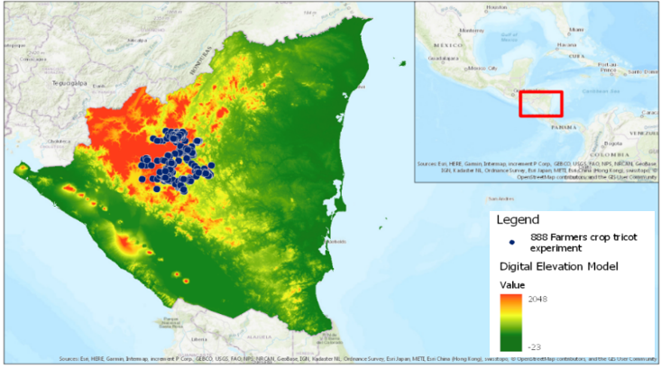
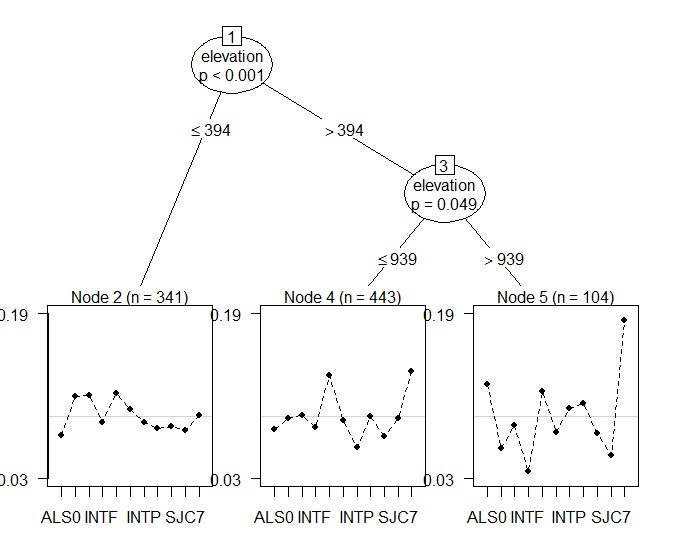
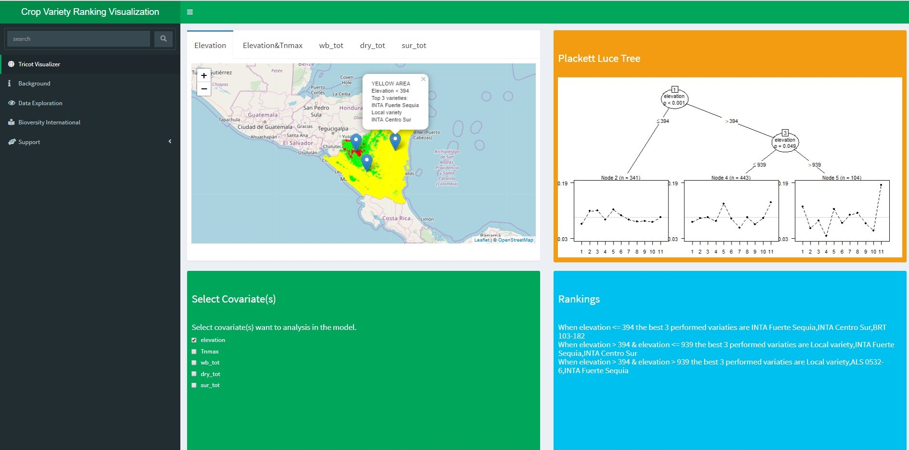

 

  
### **Abstract**

####  A rapid increase in population, urbanization, and climate change has put huge pressures on all aspects of society, and in particular agriculture. These pressures lead to a massive demand of agriculture products which is increasingly difficult to meet due to climate change, or more specifically the challenges climate change introduces to farmers. Seeds for Needs is a global initiative from the Bioversity International Research Center which is aiming to help farmers adapt better to climate change through the use of agriculture biodiversity. The method employed by this Seeds for Needs initiative is called ‘Tricot’ (Triadic Comparisons of Technologies) and consists of a farm-specific comparisons between three randomly-assigned crop varieties (sampled from a large set) which are then also compared to local varieties. **Numerous environmental datasets were linked in a spatially explicit way for each observation (e.g. elevation, temperature, and water balance), this was possible because all the farms were geo-located.** These datasets were used to produce valuable information about the interactions between crop variety performance and crop growing environment. The method employed here included the Hargreaves method which calculated the necessary evapotranspiration, and ultimately the water balance. **The _Plackett-Luce statistical model_ was then used to predict crop varieties performance under different environmental situations using model based recursive partitioning of environmental covariates.** As the data for these covariates were spatially explicit and continuous, all model results were able to be visualized by an interactive webpage which allowed farmers to assess appropriate crops for their particular farms.

####  **Keywords: Tricot, environmental covariates, water balance, Hargreaves, Plackett-Luce model, recursive partitioning, interactive webpage** 

 

###  **Example of outcomes**

#### The dataset collected from the Nicaragua area contains 888 observations from an equal number of farms from September 2015 until January 2017. Each observation contains a relative ranking of the varieties (three introduced and one local) for each farmer. Environmental conditions vary across the regions where the experiments were conducted, and ultimately affect the performance and ranking of all varieties. Water-stress, evelation and temperature data were collected for 888 farmers from September 2015 until January 2017.The goal of the Tricot experiment was thus to understand complete rankings under given environmental conditions. If quantified, farmers can now use this information to select crop varieties that are expected to thrive on their particular farms. Therefore, we want to know that _**"Under a given certain environmental conditions, what crop varieties perform best”?**_ This is the main research question of this study. 

 

####  _Figure 1 Locations of Tricot experiment (888 blue dots) in Nicaragua with digital elevation model (DEM) background_ 

 

#### Figure 2 presents one out of eight Plackett-Luce tree results. It shows the ranking of variates performance when elevation is considered as the enviroment covariates.                When elevation is lower that 394m (the left branch), the line graph shows the "variety score" of all (11) variates. The higher the dot locates, the better the performance of the corresponding variety. For instance, in the bottem left line graph, the 2nd(BRT 103-182),3rd(INTA Centro Sur) and 5th(INTA Fuerte Sequia) dots locates relatively higher (can also be interpreted as higher value). It means that these three common bean varieties could perform better than other 8 varieties when the elevation of the farm is lower than 394m.

 

####  _Figure 2: Crop performance ranking when only use elevation as environmental factor in Plackett-Luce model using R_ 

 

 

####  In this study, the performance of 888 geo-related observations in complex environments are visualized by means of an interactive map (prototype). We use the Shiny application from Rstudio, which is able to create online interactive maps. Users can select their environmental covariates of interest, such as elevation and maximum night temperature. According to these selections, a Plackett Luce tree model is executed on the server side. The user interface allows users to visualize the observations on map along with ranking information. The Plackett-Luce tree is also displayed, allowing for users to gain a deeper insight in the model. 

 

####  _Figure 3: Interactive map webpage for accessing crop variety ranking (main user interface in Rshiny)_

