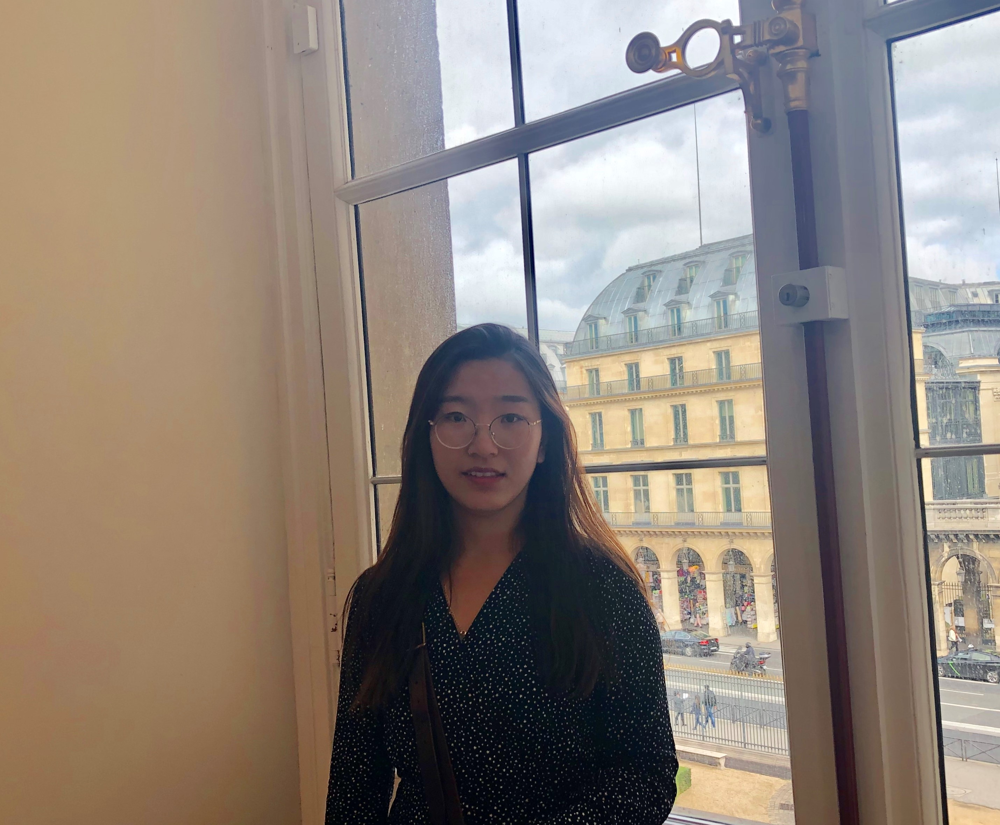

 
MSc graduate Geo-Information Science in Wageningen University & Research

 

 

## Profile

   A recent graduate student with professional experience in _**Remote Sensing**_, _**GIS**_ and _**data analytics**_. Master both scripting environments (_**R,Python**_) and dedicated GIS/RS platforms (_**QGIS, ENVI, ERDAS IMAGINE, Esri, GRASS GIS, SAGA GIS**_). Own skills with regards to large scale dataset (_**vector, raster, 3D point cloud data**_) analyzation. Always been a fast, motivated learner. Earger to explore and learn new things. Always seek challenges to improve herself. Aiming to use her knowledge as "power" to make the world a better place to live ;).

 

## Education & Experiences

 

**Master degree**
      09/2017-09/2019   
  **Wageningen University & Research**  --**Geo-information Science(GIS)**            

**Main courses:**   

- Python    
- Remote Sensing (ENVI, ERDAS)       
- Geo-scripting (R)         
- Advanced earth observation  
- Spatial modelling & statistics (R)        
- Geo-tools (Arcmap)   
- Advanced GIS  (R,Arcmap)       
- GIS in context   
- Academic Consultancy Training (Python, Arcmap, R)

 

**Internship** 
     05/2019-09/2019: 

Topic: Accuracy assessment and improvement of tree localization algorithm       
Supervisor: Smart Farm Sensing. BV,        Laurens Bierens, Joost van der Gaag, dr.ir. L (Lammert) Kooistra  (associate professor)      
Gained skills:

 

**Thesis** 
     09/2018-04/2019:

Topic: Spatial Analysis and Visualization of Triadic Crop Variety Traits in Central America    
Supervisor: dr.ir. S (Sytze) de Bruin   (associate professor)           
Gained skills: 

 

 

**Bachelor degree**
      09/2013-08/2017  
**Heilongjiang Institute of Technology** ---  **Remote Sensing**    

 

**Main courses:**   

- Advance Mathematics (82/100)        
- Probabiliry and Mathematical Statistics  (89/100)       
- College Physics Experiment (B)
- Advanced Language Programming C# (B)
- Principles and Applications of Remote Sensing  (B)         
- Digital Image Processing  (90/100)   
- Foundation of Geodesy  (88/100)    
- Surveying and Mapping Case Analysis (A)
- Computer Cartography (A)
- Photogrammetry  (90/100)    
- GNSS Navigation and Poritioning  (A)        
- Photogrammetry Field Pratice   (A)      
- Principles of Geographic Information System (91/100)    
- Urban Remote Sensing  (A)      
- CAD Technology  (A)       
- Remote Sensing Mapping  (A)       
- ENVI/IDL Remote Sensing Data Processing - 1 week  (A)       
- Professional skills integrated pratice - 4 weeks  (B)     
- Digital Mapping Principles and Methods Pratice - 4 weeks (A)      
- Surveying Pratice - 2 weeks (B)     
- Practice for RS Image Processing - 1 week (A)          
- Pratice of Professional Direction - 6 weeks (A)        
- Innovative Research and Design - 4 weeks (A)     

 

**Experiences:**   

- Awarded scholarship for 3 times

- 02/2017-03/2017     Innovative Research and Design - 4 weeks (A)     
                            

I participated "Challenge Cup" National undergraduate Business Plan Competition. In this competition, our team won the silver award of Heilongjiang division.    
Main task: making operation plan for the Pipeline Detection Application
   

- 07/2016-08/2016     Professional skills integrated pratice - 4 weeks (B) 
                            

Five peer students as a group measured all the buildings in the university by using digital levels, theodolites, and total station. As the team leader, I was in charge of making measure plans and analyze collected data. 
     

- 06/2016- 07/2016    Pratice of Professional Direction - 6 weeks (A)  
                            

As the cooperation project of the University and State Bureau of Surveying and Mapping, I joined the annual National Land Use Change Survey in Heilongjiang Province.  
The aim of the project: The State government purchase the latest remote sensing images covering the whole territory to monitor the situation of newly added built-up land and the occupation on farmland, and then send down monitoring result to the lower level goverments to assist land use chnage survey.   
Main tasks: digitalize the newly-added built-up land in Linkou county from remote sensing images in Arcmap
     

  

 

## Language

 

- Chinese -- mother tongue      

- English -- working proficiency level C1-C2            

- Dutch -- A1-A2    

 

 

## Hobby

 

- Drawing    
- Piano       
- Fitness

 

## Contact Information

 

Work Email: zhangmm1995@gmail.com     
Telephone number: +31 0615167414     
[LinkedIn link](http://www.linkedin.com/in/meng-zhang-1014)     

